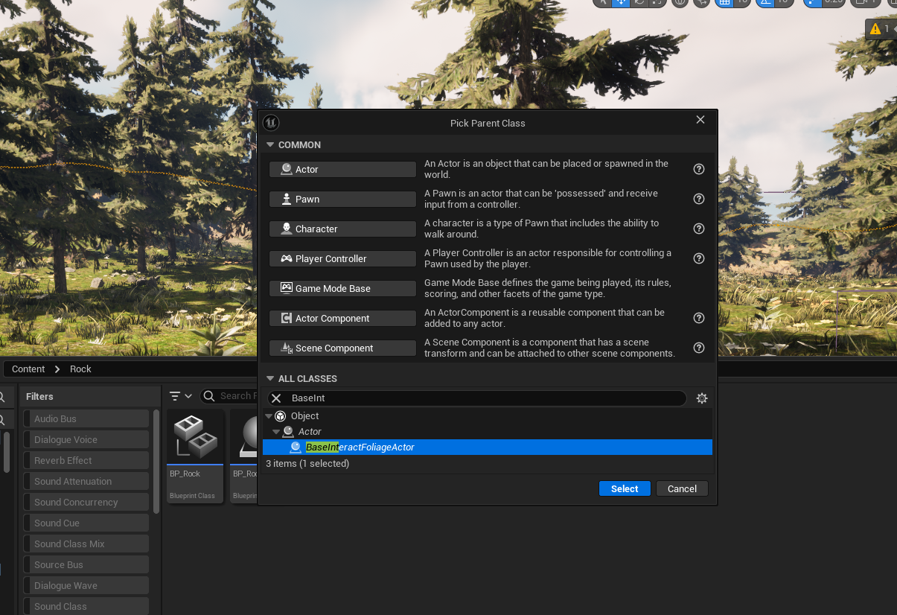
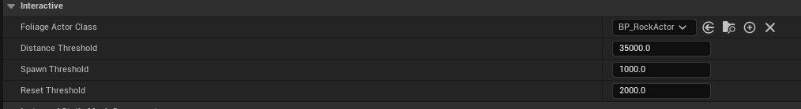
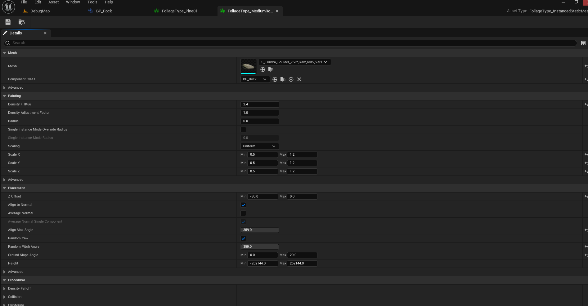
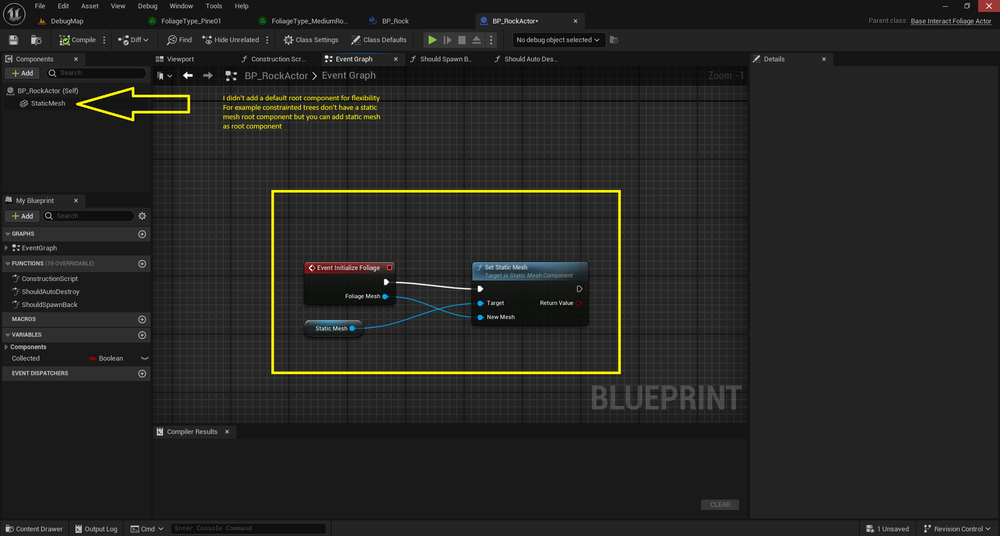

This plugin is designed to enhance the interaction with foliage in your game. It allows you to detect and hide instances of foliage and replace them with user-defined Blueprint counterparts. This can lead to more efficient and seamless interactions in your game.

The plugin supports taking ownership of the foliage or resetting it back to its initial state once the player gets far away. This feature is designed with ease of use and simplicity in mind.

Here are some example behaviors that can be achieved with this plugin:

* Chopping trees
* Collecting loot (such as rocks, herbs, or ores)
* Vehicles or characters crashing with the trees
* Constraint trees (included in the plugin and demo), where the player/vehicle can bend the trees

# Quick Start

To use this plugin, follow these steps:

1. Create a Blueprint of type BaseInteractFoliageActor and one blueprint of type InteractiveFoliageComp.

2. Open your instance of InteractiveFoliageComp and set your target Actor that this foliage spawns (the one you made in step 1).

3. Open your foliage and set its component to the InteractiveFoliageComp that you made.

4. In your Actor, override the Initialize foliage event (called when the actor is spawned) with minimal behavior.

# Understanding Params and Functions

## Foliage Component:

* DistanceThreshold: This is the distance threshold for checking the instance foliage component. Each world partition tile has a foliage component that has many instances of the same foliage type. Set this to zero to check all instances regardless of distance.

* SpawnThreshold: This is the distance threshold for spawning custom instances.

* ResetThreshold: This is the distance threshold for resetting or destroying the foliage instance.

## Foliage Actor:

* InitializeFoliage: This function is called when the actor is spawned.

* ShouldSpawnBack: This function determines whether the foliage should spawn back as its original state once destroyed. It is called when the foliage is at the reset distance.

* ShouldAutoDestroy: This function determines whether the actor should be destroyed once it is out of distance. If not, the user should handle its lifetime manually.

