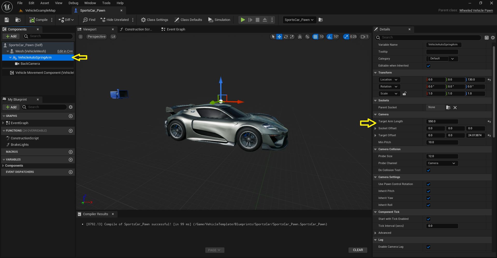

This plugin provides a dynamic spring arm system for camera movement in your game, simulation, or virtual experience. The system is designed to respond to the movements of a vehicle, adding a sense of weight and acceleration to the camera.

## Features

- Racing style automatic camera: The camera follows the vehicle's movement and orientation, providing a smooth and immersive experience.
- Manual camera control: Users can take manual control of the camera if desired, with options to pause automatic camera movement for a specified duration.
- Reaction to acceleration and deceleration: The camera's position and orientation change in response to the vehicle's acceleration and deceleration, adding realism to the experience.
- Camera shakes: The camera can play a customizable camera shake effect when the vehicle lands after being airborne for a minimum specified duration.
- Weight and reaction to direction change: The camera movement feels more realistic and responsive, with options to ignore pitch and adjust the interpolation strength for smoother results.
- Adaptable to various vehicles: The system is designed to be easily integrated and adaptable to various types of vehicles, enhancing realism and providing users with a more engaging and interactive environment.

## Quick Setup

To use this plugin, open your vehicle blueprint, add the `VehicleAutoSpringArm` component to the root component, and add a camera as a child of the `VehicleAutoSpringArm` component. Position and adjust the parameters as desired.

## Manual Input

To manually control the camera, you can use the `SetCooldown` function on mouse input to put the camera spring arm's automatic function to sleep. Once the cooldown is passed, it will blend back to the vehicle's movement direction automatically. You can also use the auto-detect input option, but the first method is more reliable.

## Parameters

The plugin includes several parameters that can be adjusted to customize the camera's behavior:

- `AutoCorrect`: If enabled, the camera will face the target speed.
- `AutoDetectInput`: If enabled, the camera will pause automatic correction for a few seconds if any user input is detected.
- `PauseSeconds`: The duration for which automatic correction is paused when user input is detected.
- `PauseSensitivity`: The sensitivity threshold for detecting user input.
- `AutoCorrectMinSpeedRange`: The minimum speed at which automatic correction starts.
- `AutoCorrectMaxSpeedRange`: The maximum speed at which automatic correction reaches its maximum effect.
- `IgnorePitch`: If enabled, the camera will ignore pitch when auto-orienting.
- `AutoCorrectInterpolationStrength`: The strength of interpolation for smoothing the result.
- `MaxArmLenChange`: The maximum arm length change when accelerating or braking.
- `MinAcceleration`: The minimum acceleration (negative values indicate braking and shorten the arm length).
- `MaxAcceleration`: The maximum acceleration when the arm reaches its maximum length.
- `ArmLenInterpolationSpeed`: The speed of interpolation for smoothing arm movement.
- `MinAirborneTimeForCameraShake`: The minimum time the vehicle must be airborne to play a camera shake effect.
- `CameraShake`: The camera shake effect to play when the vehicle lands.