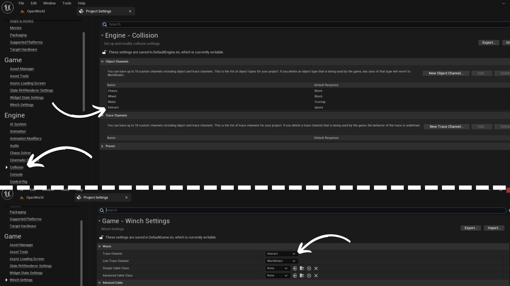
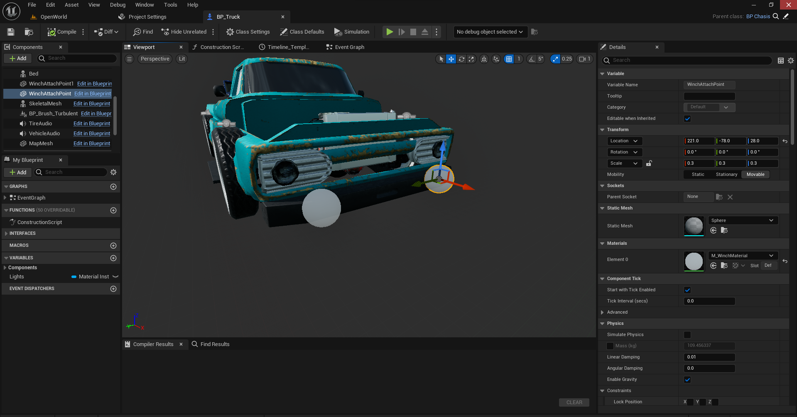
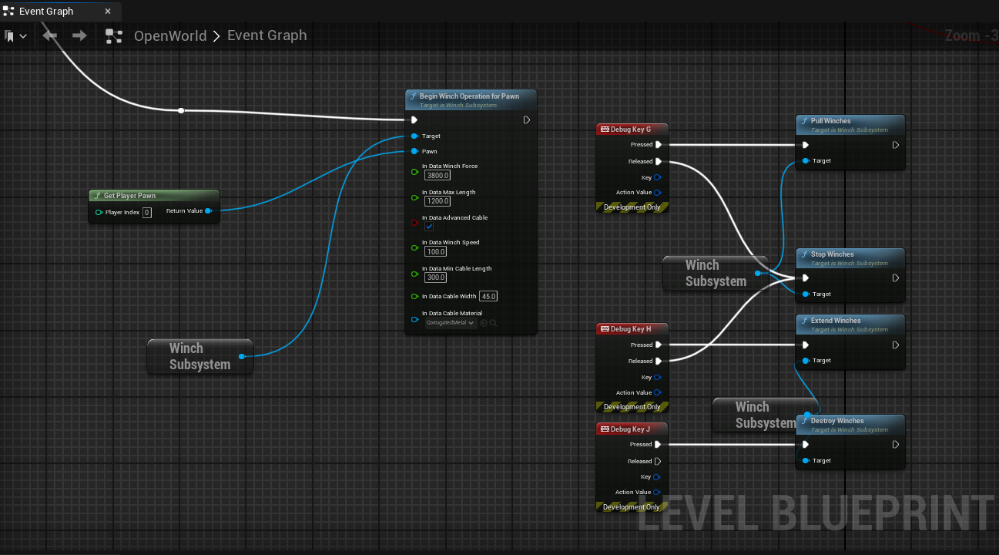

# Winch System Documentation

The winch system allows you to connect vehicles using cables to pull them around or perform any other action doable using winches. There are two types of cables: Simple cable (Default) and Advanced cable (Experimental).

### Simple Cable

The simple cable is the default and recommended method. It simply connects two objects using cables.

### Advanced Cable

The advanced cable connects two objects using a chain of collisions. This physical chain can interact with other world objects and also pull vehicles around barriers. However, it needs more user parameter tweaking to be reliable.

## Quick Setup

1. Define a new collision channel for interaction and set the new collision for interaction to the winch trace channel property.

2. Add winch attach points to your vehicle and other objects where cable connection can happen (trees, poles, etc.).

3. Call the `BeginWinchOperationForPawn` function with your desired parameters. Note that this operation enables mouse cursor on desktop devices to select attach points.

4. Call pull or extend function to interact with your winches.

# Params & Settings

| Parameter | Type | Description |
| --- | --- | --- |
| TraceChannel | TEnumAsByte<ECollisionChannel> | Trace channel for attach points click / touch. |
| LineTraceChannel | TEnumAsByte<ECollisionChannel> | Trace channel to check if something is between first and second attach point. |
| SimpleCableClass | TSubclassOf<ASimpleCable> | You can supply your own blueprint class here for the simple cable. |
| AdvancedCableClass | TSubclassOf<ASimpleCable> | You can supply your own blueprint class here for the advanced cable. |
| BodyInstance | FBodyInstance | Physics scene information for this component, holds a single rigid body with multiple shapes. |
| SpawnCollisionPerUnit | float | Number of collisions relative to cable length. |
| ShowCollisions | bool | Toggle to show or hide collisions. |
| CableAttachPointTolerance | float | When finding attach points, distance should be less than max length minus CableAttachPointTolerance so cable is not fully stretched at its initial state (for stability). |
| SphereRadius | float | Radius of the spheres used for collisions in the advanced cable. |
| CollisionMassScale | float | Increase stability but makes cable harder to move. |

# Winch Data 

| Parameter | Type | Description |
| --- | --- | --- |
| WinchForce | float | Relative to constraint force unit. |
| MaxLength | float | Max length of winch rope in 3 axis. |
| AdvancedCable | bool | To spawn advanced cable (Experimental). |
| WinchSpeed | float | The speed of winch release or pulling when it can. |
| MinCableLength | float | Winch should never reach zero for stability. |
| CableWidth | float | Cable visual width. |
| CableMaterial | UMaterialInterface* | Cable visual material. |

# Functions 

| Function | Type | Description |
| --- | --- | --- |
| BeginWinchOperationForPawn | void | Recommended method to attach winches. |
| Reset | void | Reset the operation and ignore the selected winches. |
| AttachWinch | void | Spawns the winches. Called by operation or user if the behaviour is custom |
| PullWinches | void | Pulls winches. |
| StopWinches | void | Stops winches from pull / release. |
| ExtendWinches | void | Extend the winches (not usual in games but here for flexibility). |
| DestroyWinches | void | Destroy the winches. |